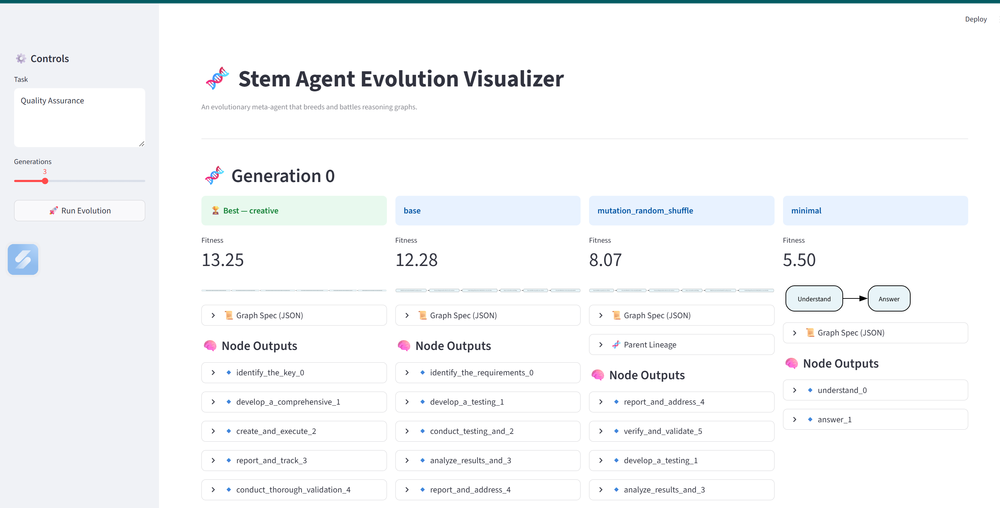
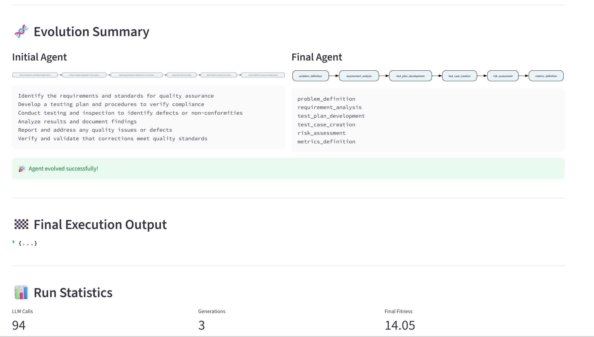

# Task1

A local project for evolving reasoning agents.

## Setup

1. Create a virtual environment:

    python -m venv .venv

2. Activate the environment:

    # PowerShell
    .\.venv\Scripts\Activate.ps1

    # Command Prompt
    .\.venv\Scripts\activate

3. Install dependencies:

    pip install -r requirements.txt

4.  Add groq api key in .env file.

## Run

### Streamlit UI

Start the interactive dashboard:

    streamlit run ui.py

Then open the URL shown in the terminal.

## Screenshots

